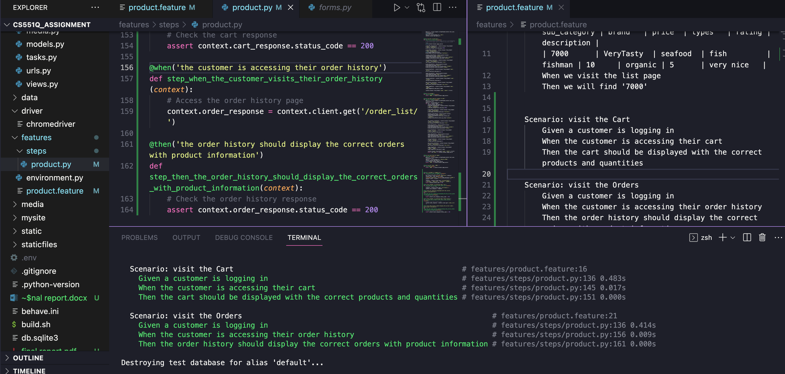

# BigBasket Shopping Website

SunJiaqi


## Website link

https://shrouded-everglades-97784.herokuapp.com/

## Prepared Data

[BIGBASKET PRODUCT | CHINMAY SHANBHAG ](https://www.kaggle.com/datasets/chinmayshanbhag/big-basket-products) by Kaggle

The original database did not contain images, so I added a column of data to the database to store images of the products. There are so many items that only the first 20 items have images uploaded, therefore not all items will display images.


⚠️ There is a slight difference between codio and github commits, due to the different settings required for localhost, celery and rabbitmq to run locally and on codio

⚠️ Due to the chromedriver problem with the behave test, the test results may not be displayed on codio. However, locally the behave test works well as follows:


## Bank cards used to test payments:

```
card Number: 4111 1111 1111 1111

CVV: 123

ExpireDate: 12/24
```

## Starting Server

Create `.env` file in root directory with below contents.

⚠️ DO NOT commit `.env` file into this repository.

```.env
DEBUG=True
```
Then, start the server with this command.

```commandline
# install dependencies
pip install -r requirements.txt

# create database
python3 manage.py parse_csv

# run server
python3 manage.py runserver 8000

# run server in Codio
python3 manage.py runserver 0.0.0.0:8000
```

## Running Tests

```commandline
python3 manage.py test
```

## Running Behave Tests

```commandline
behave
```

## When Updated models

```commandline
# create files for migration
python3 manage.py makemigrations

# execute migration
python3 manage.py migrate
```

## For Deployment in Heroku, render

```commandline
# create requirements.txt
pip list --format=freeze > requirements.txt
```

